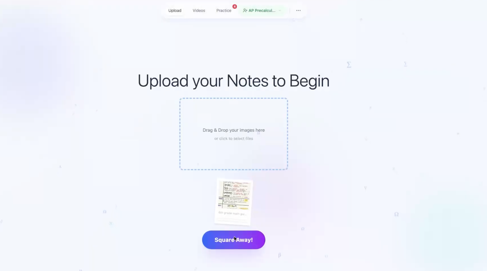
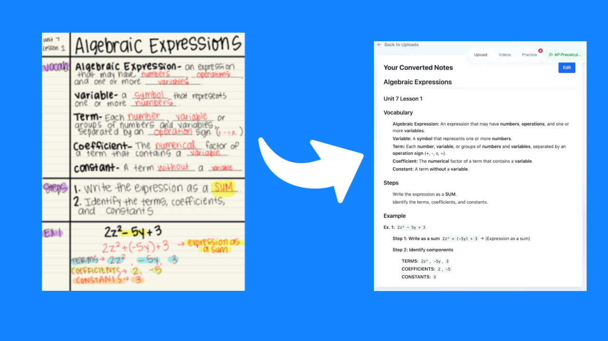
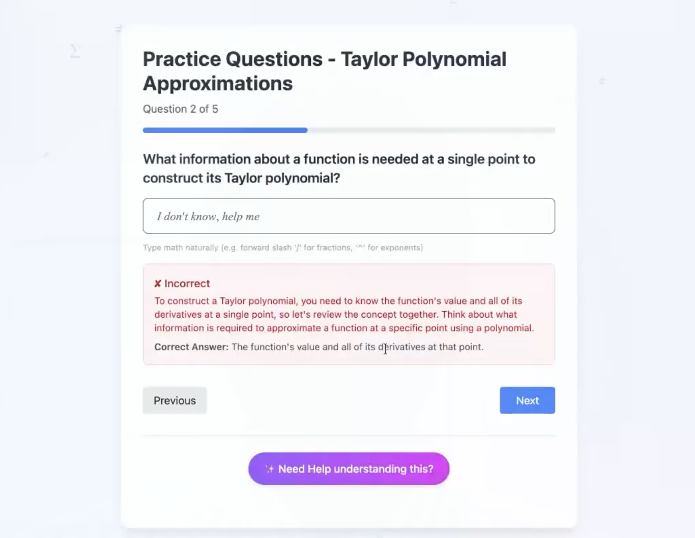
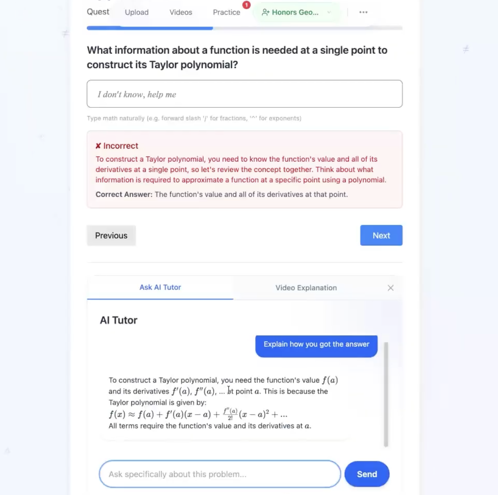
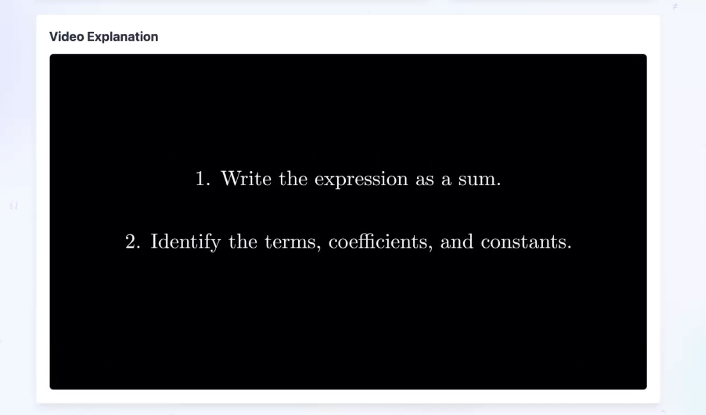

# SquareAway: AI-Powered Study Companion

SquareAway is a full-stack educational platform built to close the gap between passive studying and content understanding. Students can upload their handwritten notes or textbook pages, and SquareAway will digitize them, generate practice problems, answer questions through a built-in chatbot, and even produce a fully animated explainer video, all powered by AI.

The project was built with STEM students in mind, particularly those from underprivileged and homeschooled backgrounds. Teachers also have access to a dedicated dashboard to manage their classes and track student enrollments.

---

## Table of Contents

- [Project Overview](#project-overview)
- [Who Is This For?](#who-is-this-for)
- [Features](#features)
- [Tech Stack](#tech-stack)
- [Prerequisites](#prerequisites)
- [Installation](#installation)
- [Environment Setup](#environment-setup)
- [Running the App](#running-the-app)
- [How to Use SquareAway](#how-to-use-squareaway)
- [Project Structure](#project-structure)
- [Screenshots & Examples](#screenshots--examples)

---

## Project Overview

Most students take notes during class but never really engage with them again. SquareAway changes that. The core idea is that you upload a photo of your notes, and the app turns them into an interactive study session with AI-generated questions, a chatbot you can ask follow-up questions to, and even a narrated animated video explaining the concept.

The most technically interesting part is the Agentic Video Generation pipeline. Rather than a single API call, the system uses multiple AI agents working together: one drafts the script, a separate "Critic" agent reviews it for accuracy, a "Refiner" agent improves it if needed, and finally a code generation model writes the animation code. The Manim engine then renders it into a real MP4 video. This whole loop runs autonomously without any human input.

---

## Who Is This For?

- **Students** in math and science courses who want a more active way to review their notes
- **Visual learners** who benefit from animated explanations of complex topics
- **Teachers** looking for a tool to manage class enrollment and provide students with supplementary materials
- **Anyone** who wants to turn a wall of handwritten notes into something actually useful

---

## Features

### 1. Agentic AI Video Creation
This is the core feature. Upload your notes and the system will autonomously generate a narrated, animated explainer video. The pipeline works in five stages:

1. **Vision Analysis:** Gemini 2.5 Flash reads and understands your notes
2. **Script Generation:** Gemma 2 (27B) writes an educational script based on the content
3. **Agentic Refinement:** A Critic agent reviews the script for accuracy; a Refiner agent improves it if needed
4. **Code Generation:** Llama 4 Maverick translates the refined script into Manim animation code
5. **Rendering:** The (local running) Manim engine renders everything into a final MP4

### 2. Note Digitization
Upload a photo of handwritten notes or a textbook scan. Gemini Vision extracts the text, cleans it up, and formats it with proper mathematical notation (LaTeX). It also generates a title for the notes automatically.

### 3. Practice & Assessment
Once your notes are digitized, you can generate a custom practice set. You can choose:
- Number of questions
- Question types: multiple choice, true/false, short answer, or word problems

After submitting your answers, Groq's Llama 3.3 model grades them and gives you instant feedback.

### 4. AI Study Assistant (Chatbot)
A built-in chatbot that understands your specific notes and can answer questions about them. It handles LaTeX math formatting, so complex formulas render correctly in the chat window.

### 5. Teacher Dashboard
Teachers get a dedicated interface to create and manage classes, handle student enrollments, and remove students as needed. All data is stored in Supabase with role-based access control.

### 6. Mobile App
A companion React Native app (Expo) focused on video creation and playback, so students can generate and watch their explainer videos from their phone.

---

## Tech Stack

| Layer | Technology |
|---|---|
| Frontend (Web) | React, Vite, Tailwind CSS |
| Backend | Flask (Python) |
| Database & Auth | Supabase (PostgreSQL) |
| Mobile | React Native, Expo |
| Vision AI | Google Gemini 2.5 Flash |
| Script & Review AI | Google Gemma 2 (27B) |
| Chatbot & Grading | Groq (Llama 3.3 70B) |
| Animation Code Gen | Groq (Llama 4 Maverick) |
| Video Rendering | Manim (Mathematical Animation Engine) |
| Text-to-Speech | gTTS (Google Text-to-Speech) |

---

## Prerequisites

Make sure you have all of the following installed before you get started:

- **Python 3.8 or higher** (for the Flask backend)
- **Node.js (v18+) and npm** (for the React frontend)
- **FFmpeg** (required by Manim to process and combine video/audio)
- **LaTeX** such as TeX Live or MiKTeX (required by Manim to render mathematical symbols)
- **Manim** (the animation engine, installed via pip in setup)
- API keys for **Groq**, **Google Gemini**, and **Supabase** (see [Environment Setup](#environment-setup))

> **Note:** FFmpeg and LaTeX are system-level installs. On macOS, you can install FFmpeg with `brew install ffmpeg` and MacTeX from [tug.org/mactex](https://tug.org/mactex/). On Windows, download FFmpeg from ffmpeg.org and MiKTeX from miktex.org.

---

## Installation

Follow these steps in order. The backend and frontend are set up separately.

### Step 1: Clone the repository

```bash
git clone <repository-url>
cd SquareAway
```

### Step 2: Set up the Python virtual environment

```bash
# Create the virtual environment
python -m venv .venv

# Activate it (macOS/Linux)
source .venv/bin/activate

# Activate it (Windows)
.venv\Scripts\activate
```

### Step 3: Install Python dependencies

```bash
pip install -r requirements.txt
```

The `requirements.txt` includes: Flask, Flask-Cors, requests, python-dotenv, google-genai, and gTTS. Manim must be installed separately:

```bash
pip install manim
```

### Step 4: Install frontend dependencies

Open a new terminal window and from the project root run:

```bash
npm install
```

### Step 5: Set up your environment variables

See the [Environment Setup](#environment-setup) section below.

---

## Environment Setup

Create a file named `.env` in the root of the project directory and fill in your API keys:

```env
GROQ_API_KEY=your_groq_api_key_here
GOOGLE_API_KEY=your_google_gemini_api_key_here
SUPABASE_URL=your_supabase_project_url_here
SUPABASE_KEY=your_supabase_anon_key_here
SUPABASE_SERVICE_ROLE_KEY=your_supabase_service_role_key_here
```

Here's where to get each one:

- **GROQ_API_KEY:** Sign up at [console.groq.com](https://console.groq.com) and generate an API key
- **GOOGLE_API_KEY:** Get a Gemini API key from [aistudio.google.com](https://aistudio.google.com)
- **SUPABASE_URL / SUPABASE_KEY / SUPABASE_SERVICE_ROLE_KEY:** Found in your Supabase project under Settings > API

> ⚠️ The `.gitignore` ensures that the `.env` file (spelled exactly like that) is never exposed publicly.

---

## Running the App

You will need two terminals running at the same time: one for the backend and one for the frontend.

### Terminal 1: Start the Flask backend

Make sure your virtual environment is activated first, then:

```bash
python app.py
```

The backend starts on `http://localhost:5000` by default.

### Terminal 2: Start the React frontend

```bash
npm run dev
```

Open your browser and go to `http://localhost:5173`.

Both processes need to be running for the app to work. The frontend talks to the backend via API calls, so if the Flask server isn't up, nothing will load correctly.

---

## How to Use SquareAway

### Uploading Notes and Digitizing Them

1. On the main screen, click the **Upload Notes** button
2. Select one or more images of your handwritten notes or textbook pages (JPEG or PNG only)
3. Click **Extract** and the system will process the images and return clean, formatted digital notes
4. Your notes will appear on screen with a generated title, ready to use

### Generating Practice Questions

1. With your digitized notes loaded, navigate to the **Practice** tab
2. Choose how many questions you want (default is 5) and which question types to include
3. Click **Generate** and the questions will appear one by one
4. Fill in your answers and submit; feedback is returned instantly

**Example output for a question on Newton's Second Law:**
> *Question (Multiple Choice):* A 5 kg object accelerates at 3 m/s². What is the net force?
> - A) 8 N
> - B) 15 N ✓
> - C) 2 N
> - D) 1.67 N

### Using the AI Chatbot

1. Open the **Chat** tab with your notes loaded
2. Type any question related to your notes, for example: *"Can you explain the difference between velocity and acceleration?"*
3. The chatbot will respond with a concise explanation, including LaTeX-formatted math where relevant

**Example:**
> *You:* What is the formula for kinetic energy?
> *SquareAway:* Kinetic energy is given by $KE = \frac{1}{2}mv^2$, where $m$ is the mass in kilograms and $v$ is the velocity in meters per second.

### Generating an Explainer Video

1. Go to the **Video** tab
2. Paste in or have your notes loaded (the system uses this as the source material)
3. Click **Generate Video**
4. The system will begin the agentic pipeline. This takes a few minutes since the AI is drafting, reviewing, and refining the script before generating the animation.
5. Once complete, the video player will appear and you can watch your explainer

**Tip:** The video generation runs in the background. You don't need to stay on the page for it to finish; the backend handles it in a separate thread.

### Teacher Dashboard

1. Sign in with a teacher account
2. Use the **Dashboard** tab to create new classes
3. Manage enrollments: students can join via class code and you can remove them from the dashboard

---

## Project Structure

```
SquareAway/
├── app.py                      # Main Flask backend (all API routes live here)
├── src/                        # React frontend source
│   ├── App.jsx                 # Root component and routing
│   ├── components/             # Individual UI components (chat, upload, video, etc.)
│   ├── context/                # React context for global state
│   └── assets/                 # Prompt templates and static assets
├── mobile/                     # React Native mobile app
├── media/                      # Where Manim saves generated videos
│   └── videos/generated_manim_script/1080p60/
├── uploads/                    # Temporary storage for uploaded images
├── results/                    # Temporary storage for extraction results
├── generated_manim_script.py   # Dynamically written by the backend before rendering
├── requirements.txt            # Python dependencies
├── package.json                # Node.js dependencies
├── Dockerfile                  # Docker config for containerized deployment
└── .env                        # Your local environment variables (not committed)
```

---

## Screenshots & Examples

**Home Page**



**Note Digitization (Before and After)**



**Practice Questions and Grading**



**AI Study Chatbot**



**Manim Explainer Video**



---

## Citation

AI was used to assist with the development of this project, specifically Google Antigravity. The citation can be found below: 
Google DeepMind. (2026). Antigravity AI [Large language model]. Google.
